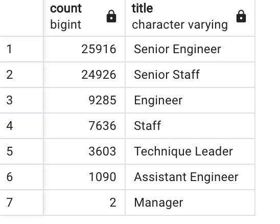

# Pewlett Hackard Analysis

## Overview of the Analysis 
Pewlett Hackard is preparing for a large amount of baby boomers who are getting ready to retire. I am helping Bobby, the HR analyst, conduct employee research. In our first assignment, we worked together to answer the following questions:
1. Who will be retiring in the next few years?
2. How many positions will Pewlett Hackard need to fill?
After answering these questions, we gave the company a list of employees elibible for their retirement package. 
Our second task, asked us to answer two further questions. 
1. What is the number of employees retiring per title?
2. Which employees are eligible to participate in a mentorship program? 
In the following report, I will list four major points from our analysis. I will also offer a summary of the company's current position. 

## Results 
The following two points are from a table in our analysis called "Retiring Titles". This table shows the number of employees who are about to retire grouped by their most recent job title. 

* The title with the most positions to fill is "Senior Engineer", which will have 25,916 employees eligible for retirement. 
* The title with the least amount of positions to fill is "Manager" with only two employees eligible for retirement. 
*
*

## Summary 